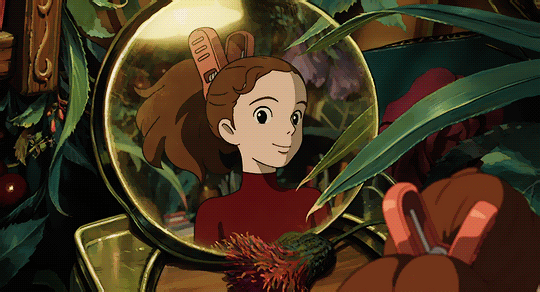

   
   
   

  ## ⭐ Hi, I'm Jeonghwa ⭐ 

   
    
  

  
  
  
   
  
  
  

   
    

  ## SNS 
  
  

 
  
<!--
**ppurify/ppurify** is a ✨ _special_ ✨ repository because its `README.md` (this file) appears on your GitHub profile.
F4D1A4
E1F3FB
EDBABA

Here are some ideas to get you started:

- 🔭 I’m currently working on ...
- 🌱 I’m currently learning ...
- 👯 I’m looking to collaborate on ...
- 🤔 I’m looking for help with ...
- 💬 Ask me about ...
- 📫 How to reach me: ...
- 😄 Pronouns: ...
- ⚡ Fun fact: ...
-->
